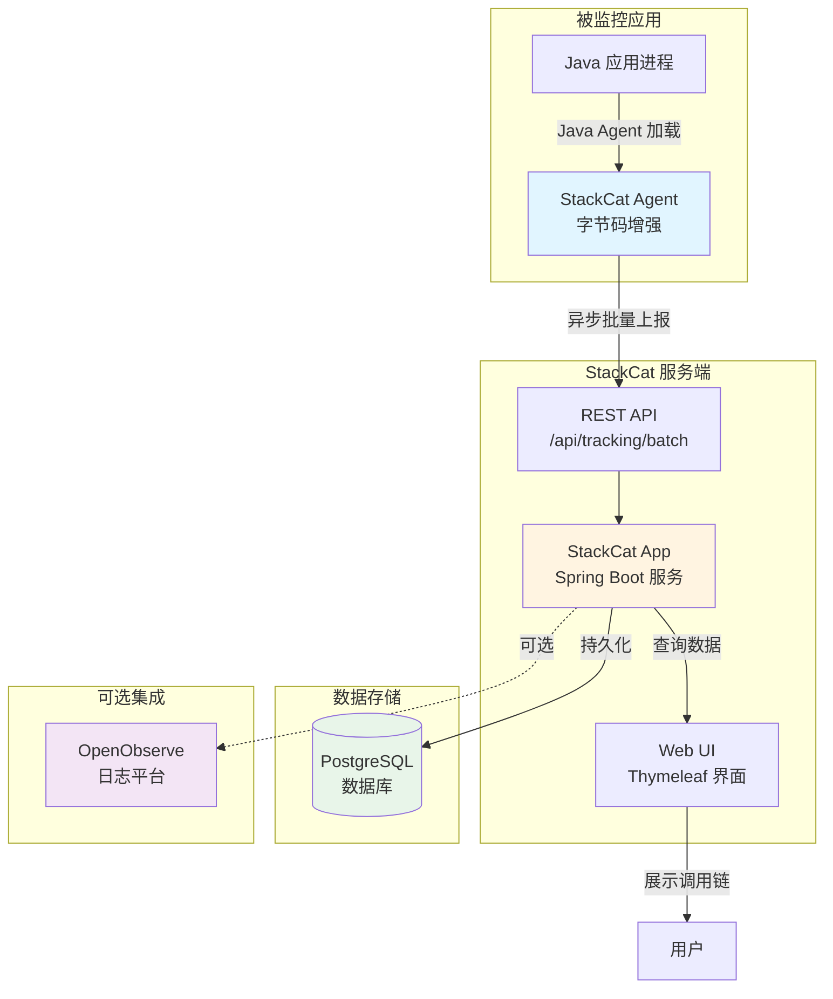
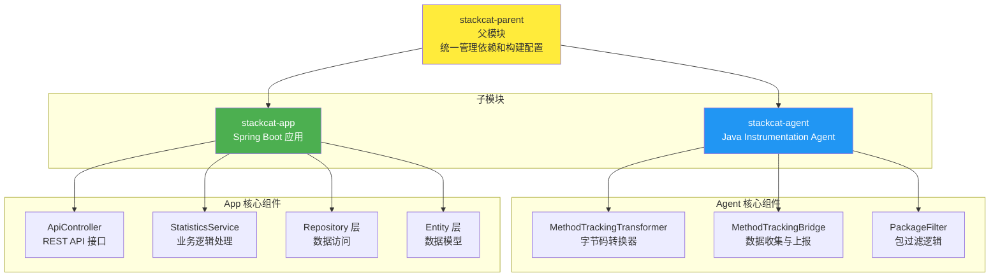

# StackCat

[](https://www.oracle.com/java/)
[](https://maven.apache.org/)
[](LICENSE)

**StackCat** 是一个开源的 Java 应用运行时调用链追踪与分析工具，采用 Java Agent 技术实现零侵入的方法调用监控，帮助开发者快速定位性能瓶颈、分析代码执行路径。

## ✨ 特性

### 🔍 深度追踪能力
- **零侵入监控**：基于 Java Instrumentation 和 ASM 字节码增强，无需修改业务代码
- **全链路追踪**：自动捕获 Controller、Service、Repository 等各层级方法调用
- **SQL 语句捕获**：支持 Spring Data JPA、MyBatis 和原生 JDBC 的 SQL 语句跟踪
- **调用树构建**：精确记录方法调用的父子关系和执行顺序

### 🚀 高性能设计
- **异步上报**：采用批量异步上报机制，最小化对业务性能的影响
- **灵活过滤**：支持包级别的 include/exclude 配置，精准控制监控范围
- **线程安全**：基于 ThreadLocal 实现线程隔离的调用链追踪

### 📊 可视化分析
- **实时仪表盘**：展示请求总数、活跃请求、方法调用统计等关键指标
- **调用链可视化**：树形结构展示完整的方法调用链，支持展开/折叠交互
- **请求搜索**：支持按请求 ID、时间范围等条件查询历史调用记录
- **SQL 关联展示**：在调用链中直接查看关联的 SQL 语句

### 🔗 可扩展性
- **OpenObserve 集成**：可结合 OpenObserve 实现链路数据的深度集中采集与分析
- **多框架支持**：内置对 Spring、MyBatis 等主流框架的适配
- **插件化设计**：支持自定义拦截器和数据上报策略

## 🏗️ 架构

### 系统架构图



### 架构说明

StackCat 采用 **Agent + Server** 的架构模式，实现零侵入的应用监控：

1. **被监控应用**：运行中的 Java 应用，通过 Java Agent 机制加载 StackCat Agent
2. **StackCat Agent**：在应用进程中运行，通过字节码增强技术收集方法调用数据
3. **StackCat App**：独立的后端服务，接收 Agent 上报的数据并提供 Web 界面
4. **PostgreSQL**：持久化存储追踪数据和统计信息
5. **OpenObserve**（可选）：可集成日志平台进行深度分析

### 数据流转

- **采集阶段**：Agent 拦截方法调用，收集调用链、SQL 语句、HTTP 请求头等信息
- **上报阶段**：Agent 通过异步批量机制将数据发送到 StackCat App
- **存储阶段**：StackCat App 将数据持久化到 PostgreSQL 数据库
- **展示阶段**：Web 界面从数据库查询数据，以树形结构展示调用链

### 模块组成



**stackcat-agent** 核心功能：
- 基于 `Instrumentation` API 和 ASM 字节码操作
- 向目标 JVM 注入方法入口/出口监控逻辑
- 拦截数据库调用（JDBC、MyBatis、JPA）
- 通过 `MethodTrackingBridge` 异步批量上报数据

**stackcat-app** 核心功能：
- Spring Boot 3 Web 应用
- 提供 REST API 接收 Agent 上报数据
- Thymeleaf 模板引擎渲染 Web 界面
- MyBatis-Plus 操作 PostgreSQL 数据库

## 🚀 快速开始

### 环境要求

- JDK 17+
- Maven 3.9+
- PostgreSQL 14+（或兼容版本）

### 构建项目

```bash
git clone <repository-url>
cd StackCat
mvn clean package
```

构建完成后：
- `stackcat-agent/target/stackcat-agent-<version>-agent.jar` - 带依赖的 Agent JAR
- `stackcat-app/target/stackcat-app-<version>.jar` - Spring Boot 可执行 JAR

### 数据库初始化

在 PostgreSQL 中执行初始化脚本：

```bash
psql -U postgres -d stackcat -f stackcat-app/src/main/resources/db/init.sql
```

或使用 psql 交互式执行：

```sql
\i stackcat-app/src/main/resources/db/init.sql
```

### 启动服务端

```bash
java -jar stackcat-app/target/stackcat-app-<version>.jar
```

默认监听 `http://localhost:8080`，访问 `http://localhost:8080` 查看仪表盘。

### 启动被监控应用

在启动你的 Java 应用时添加 Agent 参数：

```bash
java -javaagent:/path/to/stackcat-agent-<version>-agent.jar \
     -Dstackcat.filter.packages.include=com.yourcompany \
     -Dstackcat.agent.api.url=http://localhost:8080/api/tracking/batch \
     -jar your-application.jar
```

## ⚙️ 配置说明

### Agent 端系统属性

| 属性 | 说明 | 默认值 |
| ---- | ---- | ------ |
| `stackcat.filter.packages.include` | 仅跟踪指定包前缀，逗号分隔。为空时默认 `com.stackcat` | `com.stackcat` |
| `stackcat.filter.packages.exclude` | 排除特定包前缀，逗号分隔 | 空 |
| `stackcat.agent.api.url` | 上报目标地址 | `http://localhost:8080/api/tracking/batch` |
| `stackcat.agent.async.interval` | 异步发送时间间隔（毫秒） | `1000` |
| `stackcat.agent.async.batch-size` | 批量发送的最小请求数 | `10` |

### 应用端配置（`application.yml`）

主要配置项：

```yaml
spring:
  datasource:
    url: jdbc:postgresql://localhost:5432/stackcat
    username: postgres
    password: your-password

stackcat:
  filter:
    packages:
      include: ["com.yourcompany"]  # 与 Agent 侧保持一致
  agent:
    async:
      interval: 1000
      batch-size: 10
    api:
      url: http://localhost:8080/api/tracking/batch
```

完整的配置说明请参考 `stackcat-app/src/main/resources/application.yml`。

## 📊 数据模型

| 表 | 作用 | 关键字段 |
| --- | ---- | -------- |
| `request_trace` | 记录每一次请求（请求 ID、线程信息、时间区间、HTTP 头） | `request_id`, `thread_id`, `start_time`, `end_time`, `http_headers` |
| `method_call` | 存储方法调用树中的节点 | `request_trace_id`, `parent_call_id`, `sequence`, `depth`, `query` |
| `method_statistics` | 聚合统计方法调用次数、线程数及最后调用时间 | `method_name`, `call_count`, `statistics_date` |

详细的数据模型定义请参考 `stackcat-app/src/main/resources/db/init.sql`。

## 🎯 使用场景

- **性能分析**：识别慢查询、高频方法调用，定位性能瓶颈
- **问题排查**：通过调用链追踪快速定位异常发生的代码路径
- **代码理解**：可视化方法调用关系，帮助理解复杂的业务逻辑
- **接口治理**：统计接口调用情况，为接口优化提供数据支持
- **SQL 优化**：分析实际执行的 SQL 语句，发现潜在的数据库性能问题

## 📖 功能演示

### 仪表盘

访问 `http://localhost:8080` 查看实时统计：
- 总请求数
- 活跃请求数
- 总方法调用数

### 调用链追踪

访问 `http://localhost:8080/tracking` 进行调用链查询：
- 按请求 ID 搜索
- 按时间范围过滤
- 树形结构展示完整调用链
- 查看关联的 SQL 语句

## 🔧 高级功能

### 自定义包过滤

精确控制监控范围，避免外部依赖库的干扰：

```bash
-Dstackcat.filter.packages.include=com.example.service,com.example.controller
-Dstackcat.filter.packages.exclude=org.springframework,com.sun
```

### 批量上报调优

根据业务负载调整上报策略：

```bash
-Dstackcat.agent.async.interval=500    # 缩短上报间隔
-Dstackcat.agent.async.batch-size=20   # 增加批量大小
```

## 🛠️ 技术栈

### 核心技术

- **Java 21**：项目基于 Java 21 开发，充分利用现代 Java 特性
- **Spring Boot 3.5.0**：服务端应用框架
- **ASM 9.7**：字节码操作库，用于运行时方法注入
- **MyBatis-Plus 3.5.14**：数据持久化框架
- **PostgreSQL 14+**：关系型数据库
- **Thymeleaf**：服务端模板引擎

### Agent 依赖

- `org.ow2.asm:asm`：核心字节码操作
- `org.ow2.asm:asm-commons`：ASM 工具类
- `org.slf4j:slf4j-api`：日志接口
- Spring Context/Beans（provided scope）：用于反射获取请求上下文

## 🔬 工作原理

### Agent 字节码增强流程

1. **类加载拦截**：Agent 通过 `ClassFileTransformer` 拦截类加载过程
2. **ASM 字节码分析**：使用 ASM 9 解析类文件结构
3. **方法注入**：在目标方法入口和出口注入追踪代码
4. **数据收集**：通过 `MethodTrackingBridge` 收集调用信息
5. **异步上报**：后台线程批量发送数据到服务端

### 拦截点说明

StackCat 在以下关键位置进行拦截：

| 拦截点 | 目标类/方法 | 用途 |
|--------|------------|------|
| **Controller** | 包含 `controller` 的包路径 | 捕获 HTTP 请求入口，提取 requestId 和请求头 |
| **Service/Repository** | 通用业务类方法 | 记录方法调用链，构建调用树 |
| **Spring Data JPA** | `RepositoryMethodInvoker.doInvoke` | 拦截 Repository 方法，提取 SQL/JPQL |
| **MyBatis** | `SimpleExecutor.doQuery/doUpdate` | 拦截 MyBatis 执行器，提取完整 SQL |
| **JDBC** | `Connection.prepareStatement` | 捕获原生 JDBC SQL 语句 |

### 调用链构建算法

- **深度追踪**：使用 ThreadLocal 维护调用深度计数器
- **父子关系**：通过 `parentIndex` 建立方法调用的父子关系
- **序列号**：为每次调用分配递增序列号，保证调用顺序
- **SQL 关联**：通过线程本地变量关联 SQL 语句到对应的 Repository 方法

## 📡 API 文档

### 数据上报接口

#### POST `/api/tracking/batch`

接收 Agent 批量上报的追踪数据。

**请求体示例**：
```json
[
  {
    "requestId": "req-123456",
    "startTime": "2024-01-01T10:00:00",
    "endTime": "2024-01-01T10:00:01",
    "headers": {
      "User-Agent": "Mozilla/5.0",
      "Accept": "application/json"
    },
    "methodCalls": [
      {
        "className": "com.example.controller.UserController",
        "methodName": "getUser",
        "packageName": "com.example.controller",
        "depth": 0,
        "sequence": 0,
        "callTime": "2024-01-01T10:00:00.100",
        "parentIndex": -1,
        "query": null
      }
    ]
  }
]
```

**响应**：`200 OK` 返回 `"OK"`

### 查询接口

#### GET `/api/tracking/active`

获取当前活跃的请求列表。

**响应示例**：
```json
[
  {
    "id": 1,
    "requestId": "req-123456",
    "threadId": 42,
    "threadName": "http-nio-8080-exec-1",
    "startTime": "2024-01-01T10:00:00",
    "endTime": null,
    "httpHeaders": "{\"User-Agent\":\"...\"}",
    "createdAt": "2024-01-01T10:00:00"
  }
]
```

#### GET `/api/tracking/history`

查询历史请求记录。

**查询参数**：
- `requestId` (可选)：请求 ID
- `startTime` (可选)：开始时间（ISO 8601 格式）
- `endTime` (可选)：结束时间（ISO 8601 格式）

**示例**：
```
GET /api/tracking/history?requestId=req-123456&startTime=2024-01-01T00:00:00&endTime=2024-01-01T23:59:59
```

#### GET `/api/tracking/tree/{requestTraceId}`

获取指定请求的完整调用树。

**响应示例**：
```json
[
  {
    "id": 1,
    "requestTraceId": 1,
    "parentCallId": null,
    "methodName": "getUser",
    "className": "com.example.controller.UserController",
    "packageName": "com.example.controller",
    "callTime": "2024-01-01T10:00:00.100",
    "sequence": 0,
    "depth": 0,
    "query": null,
    "children": [
      {
        "id": 2,
        "methodName": "findById",
        "className": "com.example.service.UserService",
        "depth": 1,
        "query": "SELECT * FROM users WHERE id = ?"
      }
    ]
  }
]
```

#### GET `/api/statistics/method`

获取方法调用统计信息。

**查询参数**：
- `methodName` (可选)：方法名（支持模糊匹配）
- `startDate` (可选)：开始日期
- `endDate` (可选)：结束日期

#### GET `/api/statistics/overview`

获取统计概览。

**响应示例**：
```json
{
  "totalRequests": 1000,
  "activeRequests": 5,
  "totalMethodCalls": 5000
}
```

## 🐛 故障排查

### 常见问题

#### 1. Agent 未生效

**症状**：应用启动后没有看到追踪数据。

**排查步骤**：
1. 检查 JVM 启动参数是否包含 `-javaagent`
2. 查看应用日志，确认 Agent 是否加载成功（查找 "Starting method tracking agent..."）
3. 验证包过滤配置是否正确：
   ```bash
   -Dstackcat.filter.packages.include=com.yourcompany
   ```
4. 确认目标类是否在过滤范围内

#### 2. 数据未上报到服务端

**症状**：Agent 日志显示数据收集正常，但服务端没有收到数据。

**排查步骤**：
1. 检查服务端是否正常运行（访问 `http://localhost:8080/api/statistics/overview`）
2. 验证 `stackcat.agent.api.url` 配置是否正确
3. 检查网络连通性（Agent 能否访问服务端）
4. 查看 Agent 日志中的错误信息
5. 检查服务端日志，查看是否有接收错误

#### 3. SQL 语句未捕获

**症状**：调用链中 Repository 方法的 `query` 字段为空。

**排查步骤**：
1. **Spring Data JPA**：
   - 检查是否使用了 `@Query` 注解（会从注解中提取）
   - 确认是否使用了自定义 Repository 实现
2. **MyBatis**：
   - 验证 MyBatis 版本兼容性
   - 检查是否使用了自定义 Executor
3. **原生 JDBC**：
   - 确认数据源是否支持 `prepareStatement` 拦截
   - 检查是否有连接池代理层（如 HikariCP）影响拦截

#### 4. 性能影响

**症状**：应用启动变慢或运行时性能下降。

**优化建议**：
1. 缩小包过滤范围，只监控必要的包
2. 增加批量上报大小，减少网络请求频率
3. 调整上报间隔，平衡实时性和性能
4. 排除高频调用的框架类（如 Spring 内部类）

### 调试模式

启用详细日志以排查问题：

**Agent 端**：
```bash
-Djava.util.logging.config.file=logging.properties
```

**服务端**（`application.yml`）：
```yaml
logging:
  level:
    com.stackcat: DEBUG
    org.springframework.web: DEBUG
```

## ⚡ 性能优化建议

### Agent 端优化

1. **包过滤策略**：
   - 只包含业务代码包，排除框架包
   - 使用精确的包前缀，避免过度匹配

2. **批量上报调优**：
   ```bash
   # 高并发场景
   -Dstackcat.agent.async.batch-size=50
   -Dstackcat.agent.async.interval=2000
   
   # 低延迟要求
   -Dstackcat.agent.async.batch-size=5
   -Dstackcat.agent.async.interval=500
   ```

3. **避免递归**：
   - Agent 自动排除 `com.stackcat.agent.*` 包
   - 确保过滤配置不会包含 Agent 自身

### 服务端优化

1. **数据库索引**：
   - 确保 `request_trace` 表的 `request_id`、`start_time` 有索引
   - `method_call` 表的 `request_trace_id`、`sequence` 有索引

2. **连接池配置**：
   ```yaml
   spring:
     datasource:
       hikari:
         maximum-pool-size: 20
         minimum-idle: 5
   ```

3. **数据清理策略**：
   - 定期清理历史数据，避免表过大
   - 考虑按时间分区存储

## 🔒 安全注意事项

1. **敏感信息**：
   - HTTP 请求头可能包含敏感信息（如 Authorization），建议在生产环境过滤
   - SQL 语句可能包含参数值，注意数据脱敏

2. **网络通信**：
   - 生产环境建议使用 HTTPS 进行 Agent 到服务端的通信
   - 配置防火墙规则，限制服务端访问

3. **数据存储**：
   - 定期备份数据库
   - 考虑数据加密存储

4. **访问控制**：
   - 为 Web 界面添加认证机制
   - 限制 API 访问权限

## 📚 更多示例

### Spring Boot 应用集成

在 `application.properties` 中配置：

```properties
# JVM 参数
-javaagent:/path/to/stackcat-agent-1.0.0-agent.jar
-Dstackcat.filter.packages.include=com.yourcompany
-Dstackcat.agent.api.url=http://localhost:8080/api/tracking/batch
```

### Docker 部署

**Dockerfile 示例**：
```dockerfile
FROM openjdk:21-jdk-slim

COPY stackcat-agent-1.0.0-agent.jar /app/agent.jar
COPY your-app.jar /app/app.jar

ENTRYPOINT ["java", \
  "-javaagent:/app/agent.jar", \
  "-Dstackcat.filter.packages.include=com.yourcompany", \
  "-Dstackcat.agent.api.url=http://stackcat-app:8080/api/tracking/batch", \
  "-jar", "/app/app.jar"]
```

### Kubernetes 配置

**Deployment 示例**：
```yaml
apiVersion: apps/v1
kind: Deployment
metadata:
  name: your-app
spec:
  template:
    spec:
      containers:
      - name: app
        image: your-app:latest
        command: ["java"]
        args:
        - "-javaagent:/agent/stackcat-agent.jar"
        - "-Dstackcat.filter.packages.include=com.yourcompany"
        - "-Dstackcat.agent.api.url=http://stackcat-app:8080/api/tracking/batch"
        - "-jar"
        - "/app/app.jar"
        volumeMounts:
        - name: agent
          mountPath: /agent
      volumes:
      - name: agent
        configMap:
          name: stackcat-agent
```

## 🤝 贡献指南

我们欢迎社区贡献！请遵循以下步骤：

1. Fork 本仓库
2. 创建特性分支 (`git checkout -b feature/AmazingFeature`)
3. 提交更改 (`git commit -m 'Add some AmazingFeature'`)
4. 推送到分支 (`git push origin feature/AmazingFeature`)
5. 开启 Pull Request

### 开发环境设置

```bash
# 克隆仓库
git clone <repository-url>
cd StackCat

# 编译项目
mvn clean install

# 运行测试
mvn test
```

## 📝 License

本项目采用 MIT License。详见 [LICENSE](LICENSE) 文件。

## 🔮 未来规划

- **AI 智能分析**：集成 DeepSeek / ChatGPT 等大模型，为调用链、统计数据、SQL 语句和索引策略提供自动诊断与优化建议
- **多框架支持**：扩展对 gRPC、Dubbo、Spring Cloud Gateway 等框架的拦截，覆盖跨服务链路与异步任务
- **性能监控**：引入调用耗时分布、瓶颈识别、异常模式告警以及 SLA 趋势分析
- **企业功能**：支持实时拓扑可视化、报告导出、多租户隔离与访问控制
- **OpenObserve 集成**：深度融合 OpenObserve，实现链路数据的集中采集、长周期检索与多维度关联分析

## 💬 支持与反馈

- 提交 Issue：[GitHub Issues](https://github.com/your-repo/StackCat/issues)
- 讨论区：[GitHub Discussions](https://github.com/your-repo/StackCat/discussions)

## 🙏 致谢

感谢所有为本项目做出贡献的开发者和用户！

---

**StackCat** - 让 Java 调用链追踪变得简单 ✨
